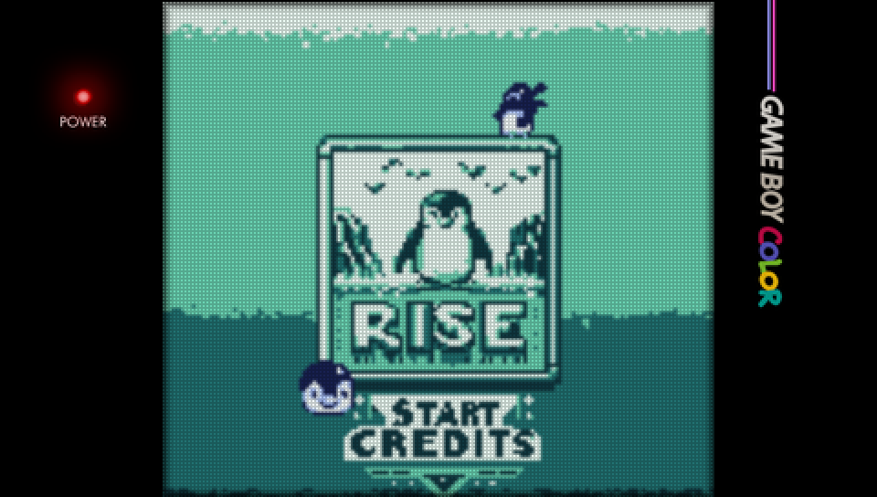
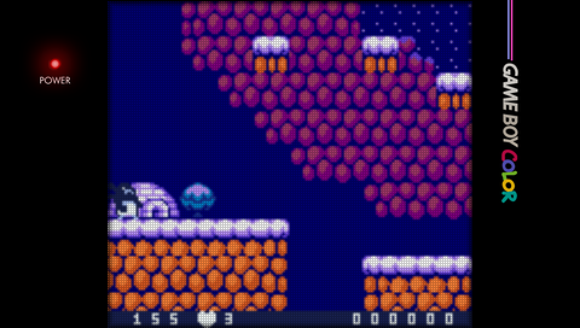
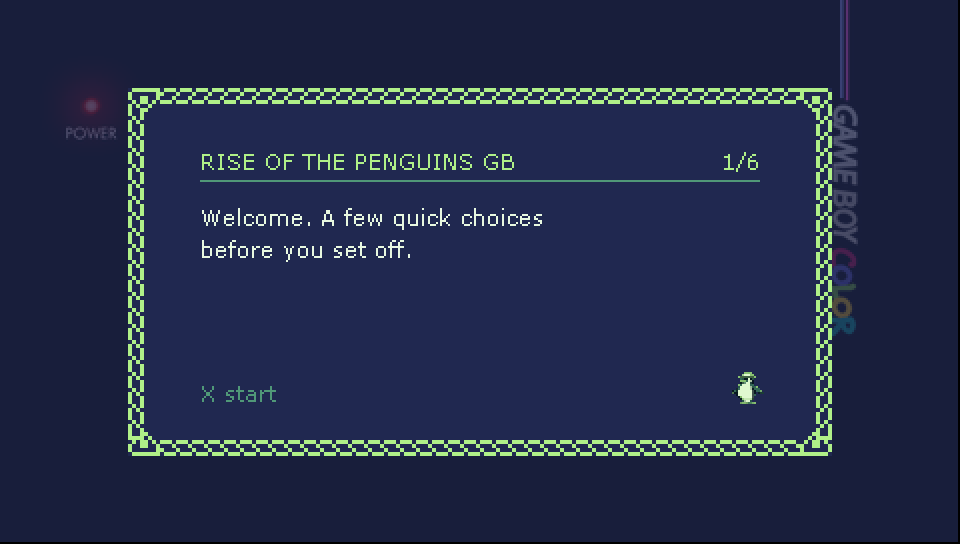
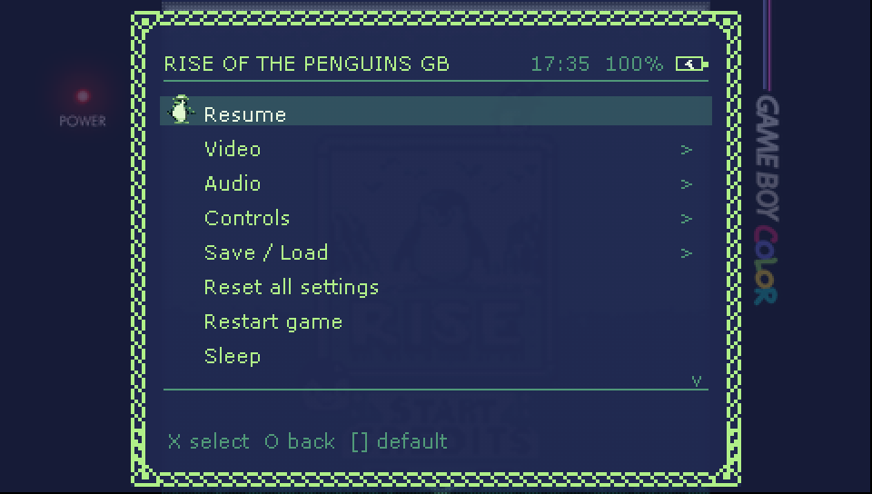
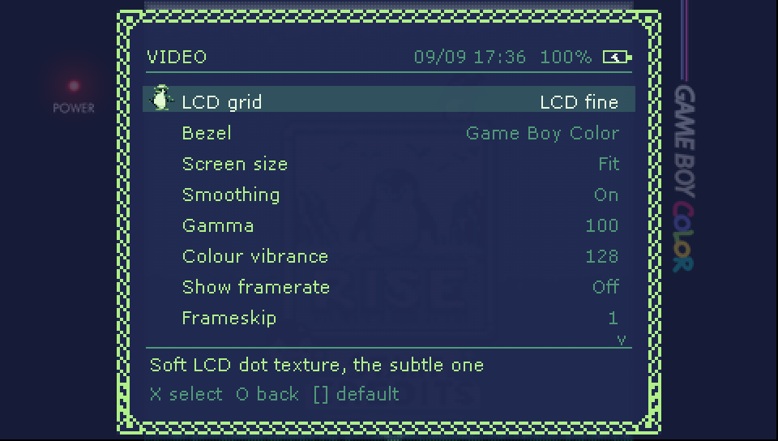
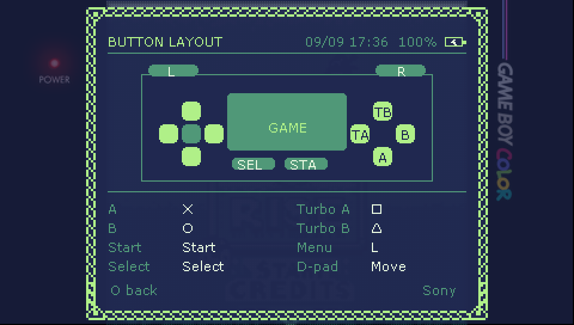
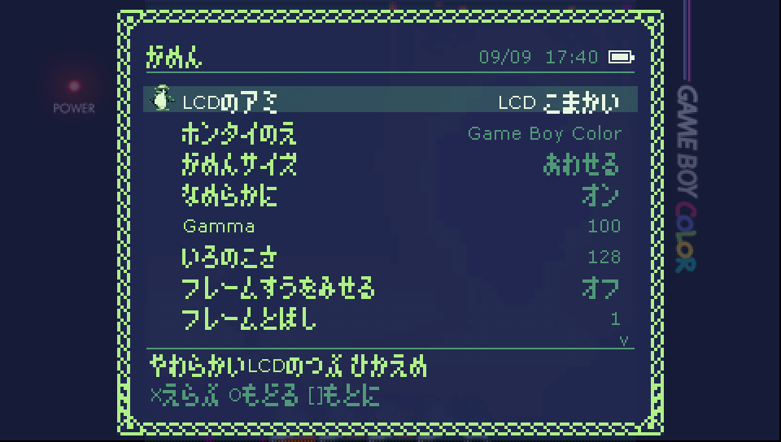

# Rise of the Penguins GB — PSP Port

A standalone PlayStation Portable (PSP) port of **Rise of the Penguins GB**.

[](https://youtu.be/eO2SXsNq2-w)

▶️ **[Watch it running on YouTube](https://youtu.be/eO2SXsNq2-w)**

- **Auto-Resume & Autosave:** Picks up right where you left off when you quit or relaunch, with continuous background save protection.
- **Custom In-Game Menu (L Trigger):** Dedicated retro-styled settings menu with custom audio
  chirps and controller layout viewer, with the date, clock and battery gauge along the top.
- **First-Run Setup:** A short guided wizard on the very first launch covers button layout, bezel, LCD grid and sound, so nothing worth changing stays buried.
- **Button Layout Presets:** Swap A and B between the Sony and Game Boy arrangements in one step, or rebind every button by hand.
- **Sleep:** Suspend the PSP straight from the menu, without reaching for the power switch. Saves are flushed first.
- **Custom Bezels & Shaders:** Handheld console borders (adapted from Watomsk) and authentic LCD pixel grid filters.
- **Localised Menus:** The in-game menu and first-run setup follow the build's language -
  all ten, including Polish and Japanese, which ship fonts of their own for the letters
  the stock one cannot draw. The translated builds carry an XMB icon tagged with their
  language, so they can be told apart at a glance; the English build keeps the plain one.
- **Persistent Settings:** Video scaling, filters, volume, and control remaps save automatically.

---

## 🐧 Get the Game

- [Steam](https://store.steampowered.com/app/3404520/Rise_of_the_Penguins_GB/)
- [itch.io](https://billwoo.itch.io/rise-of-the-penguins-gb)
- [Epic Games Store](https://store.epicgames.com/en-US/p/rise-of-the-penguins-gb-e40916)
- [Microsoft Store](https://apps.microsoft.com/detail/9n27rwtgzsc4)
- [Google Play](https://play.google.com/store/apps/details?id=com.pwoo.riseofthepenguinsgb)
- [PortMaster](https://portmaster.games/detail.html?name=riseofthepenguinsgb)
- [Flathub](https://flathub.org/en/apps/io.github.masterbillwoo.RiseOfThePenguinsGB)
- [Newgrounds](https://www.newgrounds.com/portal/view/978420)
- [Game Jolt](https://gamejolt.com/games/riseofthepenguinsgb/990375)
- [Chrome Web Store](https://chromewebstore.google.com/detail/rise-of-the-penguins-gb/jekackfalnabbmpmfhgkjhgggnndhcod)
- [Microsoft Edge Add-ons](https://microsoftedge.microsoft.com/addons/detail/rise-of-the-penguins-gb/miokjomgpgejnagijfinmehmdhmeehfn)
- [Firefox Add-on](https://addons.mozilla.org/en-US/firefox/addon/riseofthepenguinsgb/)

---

## 📸 Screenshots

| | |
|---|---|
|  |  |
| **In game**, running through the Game Boy Color shell | **First-run setup** — asked once, on the very first launch |
|  |  |
| **In-game menu** — hold L, with the clock and battery along the top | **Video settings** — every row explains itself as you land on it |
|  |  |
| **Button layout** — drawn from the live bindings, so it is never out of date | **Japanese** — kana and kanji from the game's own font |

---

## 💬 Community

Come say hello, report a bug, or show off a run:

- [Discord](https://discord.com/invite/3jJVx87rGx)
- [Telegram](https://t.me/pwoowoo)

---

## 🕹️ Controls

### In-Game (Sony preset, the default)
Swap to the **Game Boy** preset under *Controls > Layout preset* and A/B trade
places: Circle becomes A, Cross becomes B, Triangle Turbo A, Square Turbo B.

| PSP Button | Game Boy Function |
|---|---|
| **D-Pad / Analog Stick** | Directional Movement |
| **Cross (X)** | **A** (Jump / Action) |
| **Circle (O)** | **B** (Run / Cancel) |
| **Square ([])** | Turbo A |
| **Triangle (/\\)** | Turbo B |
| **Start** | Start (In-game pause / menu) |
| **Select** | Select |
| **L Trigger** | **In-Game Menu** (Display, Audio, Controls, Saves) |
| **HOME** | Return to PSP XMB |

### Shortcuts
| Combination | Action |
|---|---|
| **R + Select** | Quick Save State |
| **R + Start** | Quick Load State |
| **R + Up / Down** | Next / Previous Save Slot |
| **R + Square** | Fast Forward (Turbo) |
| **R + Triangle** | Slow Motion |
| **R + Cross** | Pause Emulation |
| **R + Circle** | Screenshot |

### In-Game Menu
- **D-Pad Up / Down:** Navigate options
- **D-Pad Left / Right:** Adjust option values
- **Cross (X):** Select / Confirm / Rebind Button
- **Circle (O):** Back / Close Menu
- **Square ([]):** Reset selected option to default
- **L Trigger:** Toggle Menu Closed

Worth knowing: *Controls > Button layout* draws the pad with every button
labelled by what it actually does, and **Sleep** on the main page suspends the
console after writing your save.

---

## 💾 Installation

### Physical PSP (PSP-1000 / 2000 / 3000 / Street / Go)
1. Ensure your PSP runs custom firmware (6.60 / 6.61 PRO or ME).
2. Connect your PSP via USB (or insert your Memory Stick into a PC).
3. Copy the `RiseofthePenguinsGB` folder from `dist/` into:
   ```
   ms0:/PSP/GAME/RiseofthePenguinsGB/
   ```
   *(For PSP Go internal storage, use `ef0:/PSP/GAME/RiseofthePenguinsGB/`)*
4. Launch the game from the PSP XMB **Game > Memory Stick** menu.

### PPSSPP Emulator
1. Copy the `RiseofthePenguinsGB` folder into your PPSSPP `memstick/PSP/GAME/` directory.
2. Launch PPSSPP and select the game from the list.

---

## 🛠️ Building From Source

### 1-Step Build via Docker (Recommended)
Requires Docker and Python 3:
```bash
bash build/docker-build.sh
python build/package.py
```
This builds the EBOOT binary inside the PSPSDK container and packages the standalone distribution bundle into `dist/RiseofthePenguinsGB/`.

---

## ⚖️ License & Credits

- **Rise of the Penguins GB:** Original game, art, and assets © All rights reserved.
- **MasterBoy Core:** Licensed under the [GNU General Public License v2.0](LICENSE). Derived from MasterBoy 2.10 by Brunnis and upstream contributors.
- **Console Bezels & LCD Overlays:** Adapted from Watomsk's handheld overlay collection, tailored for PSP 480x272 display geometry.

